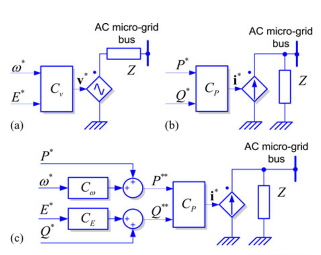
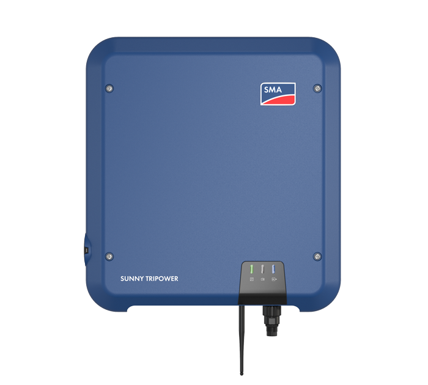
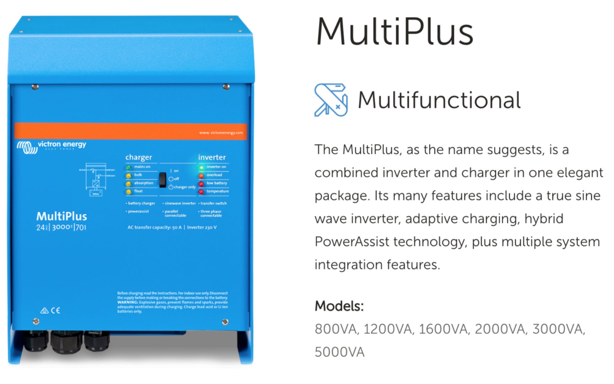
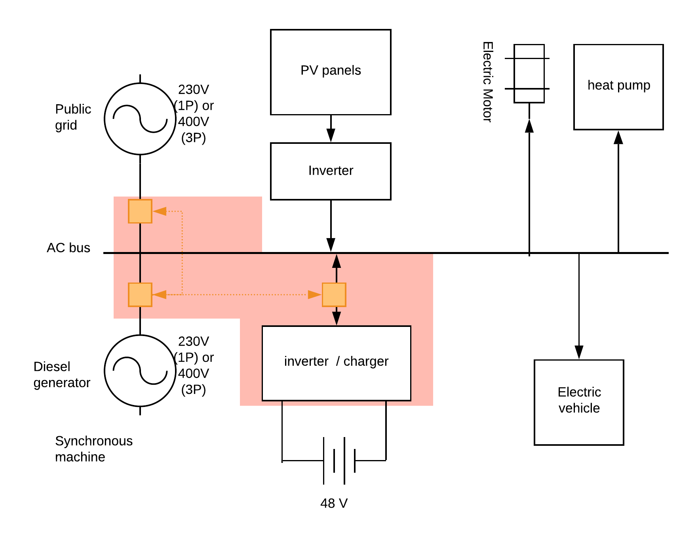
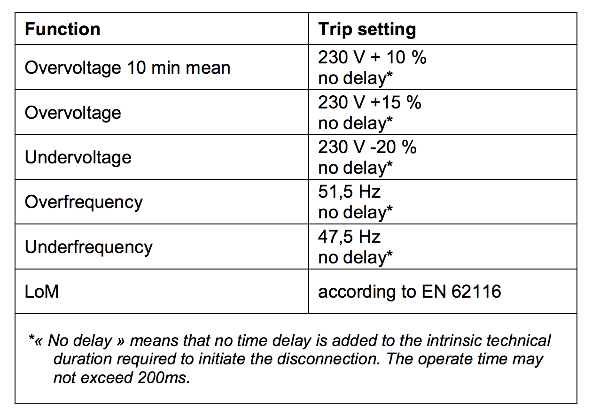
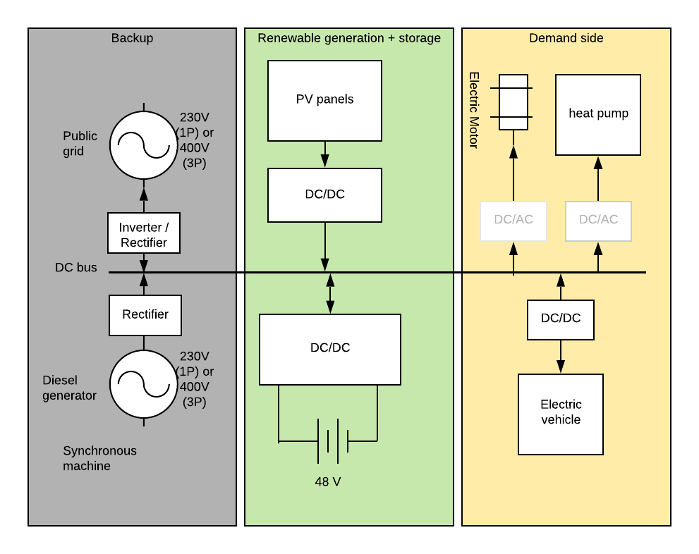

class: middle, center, title-slide
count: false

# Microgrids

Microgrid architectures

  

Bertrand Cornélusse 
[bertrand.cornelusse@uliege.be](mailto:bertrand.cornelusse@uliege.be)

---

## Content of this lecture

In this lecture we review microgrids architectures, that is which components form a microgrid and how to interconnect them.

In the next lectures we will focus on the components themselves, on features that are
important for operation, both from a technical point of view and from an economical point of view.

---

# AC grids

An alternating current (AC) microgrid is a microgrid where components are coupled through one AC bus (if there is only one voltage level).

- Most microgrids are AC
- Typically, AC microgrids where the demand > 5kW are three-phase!
 - Required if you want to connect to the public grid (in Belgium)
 - Equipment in general require less components per unit of power transferred
 - Easy to generate a rotating field for motors
 - (Three-phase power transfer is a constant expression, if the phases are balanced)
 
---

## Grid topologies

Most common: **radial** architecture
 - Subject to availability issues (one single path to a load)

Alternatives:
 1. provide a **redundant path** to each load (more robust than radial)
 2. provide **spatially diverse paths** (more robust than 1)
 3. **ring-type** distribution (Can isolate a fault and still feed all but problematic zone)
 4. **ladder type** distribution (yet more connection possibilities)

Note: a more complex system also needs more complex protection schemes. 

See chapter 7 of [1] for more information.

---

## AC coupling example

Let's take the example of a house or a small company that is running at low-voltage (230V or 400V) and has a grid connection plus a backup diesel generator, some PV panels, a battery, and some appliances.

.center.width-80[]

---

## Automatic transfer switches

.width-100[]

---

class: middle, center, black-slide

<iframe width="600" height="450" src="https://www.youtube.com/embed/883JgMK9EGg" frameborder="0" allowfullscreen></iframe>

Automatic transfer switch principle

---

# Power electronics interfaces

Power electronic circuits are interfaces
- between devices (DERs and loads) and the power distribution grid
- between the microgrid and the distribution grid (PCC)

Purpose: enable a controllable (bidirectional) flow between devices

*DER: sources of electric power that are not directly connected to a bulk power transmission system. Distributed energy resources include both generators and energy storage technologies. (T.Ackermann, G.Andersson, and L.Söder, “Distributed Generation: A Definition,” Electric Power Systems Research, vol. 57, issue 3, April 2001, pp. 195–204.)

---

## Types of power electronics interfaces (from [2]) $\rightarrow$ More in next lecture.

*Grid-following* converters (Fig (b)): can be represented as an ideal current source setting the active and reactive power injected into / withdrawn from the grid. 

*Grid-forming* converters (Fig (a)): can be represented as an ideal AC voltage source setting the voltage amplitue and frequency of the local electrical grid. 

*Grid-supporting* converters (Fig (c)): "inbetween the two others", implementing functions to support the grid, e.g. droop control.

.center.width-50[]

All these functions are achieved using several nested control loops.

---

## Example: solar inverter

.grid[
.kol-1-2[.width-100[]]
.kol-1-2[.width-100[]]
]
Here it is a three-phase inverter from SMA.
Source: website of SMA

Requires a network signal to work!

---

## Example: Vehicle to grid

.width-100[]

---

class: middle, center, black-slide

<iframe width="600" height="450" src="https://www.youtube.com/embed/5FAsadUM26I" frameborder="0" allowfullscreen></iframe>

---

## Example: Automatic transfer switch, grid forming inverter & battery charger

.grid[
.kol-1-2[.width-100[]]
.kol-1-2[.width-100[]]
]
Source: website of Victron.

---

## Characterizing power distribution architectures based on how power conversion is performed

- Centralized: power conversion is performed at a single power electronic interface. Example:
.grid[
.kol-1-2[.width-80[]]
.kol-1-2[.width-80[]]
]
- Distributed: power conversion functions are spread among converters
 - may lead to parallel or cascade structures

.footnote[Source:https://www.alma-solarshop.com/solax-power-inverter/982-hybrid-solax-inverter-x1-50t-hv.html]

---

class: middle, center

# Rules for connecting DER to the grid (Belgian case, C10/11)

---

## Synergrid

Synergrid is the federation of electricity and gas network operators in Belgium. Synergrid establishes prescriptions for a series of topics related to distribution systems. 

In the "Technical Prescription C10/11 of Synergrid, edition 2.1 (01.09.2019) (English translation)", you can find the rules that apply to a new installation.

"This document C10/11 lays down the technical requirements relating to the connection of power generating plants capable to operate in parallel to the distribution network. The objectives of this
document are the following:
- ensuring proper operation of the distribution networks;
- improving the safety of staff active in these networks;
- protecting the distribution network’s infrastructure;
- and contributing to the general system stability. "

---

## Application domain of C10/11

Applies to:
- Plants < 25MW connected to the distribution grid
- Any energy source 
- Without limitation regarding the possibility of actually injecting energy to the distribution network; this means, for example, that it is also applicable to power-generating
plants equipped with a zero export relay. (...)
- ...

But not to:
- Off-grid systems
- Backup systems (not actually able to feed in the grid)
- ... (elevators)

---
## Special cases 

A power backup system (as specified in § 4.1.9) will only operate in parallel with the distribution network for a short time in the following sporadic cases: 

- During tests
- In case of islanding / reconnection after a network faults (*"make-before-break"*)
- ...

There are maximum durations depending on the cases.

--

In case of *infringment*, either:
.grid[ 
.kol-1-2[
- all rules of C10/11 apply to the backup system
- or parallel operation made impossible
]
.kol-1-2[<iframe src="https://giphy.com/embed/x6RunS9u1L3AA" width="240" height="135" frameBorder="0" class="giphy-embed" allowFullScreen></iframe>

]
]

---

## Maximum power limits for a small power-generating plant

.center.width-80[]

 - Each power-generating unit must be equipped with an *automatic separation system*
 - If the power-generating plant includes an energy storage system,
   - an *EnFluRi* sensor must be provided to control the power injected on the distribution network. 
   - the EnFluRi sensor is a directional power sensor having a communication link with the energy storage system. 
   - the power injected into the distribution network is limited to the maximum power of the other means of power-generation. 

---

## Settings of the automatic separation system (Annex C)

.center.width-80[]

---

## Syncrocheck 

The power-generating units which synchronize with the voltage on the distribution network (such as synchronous machines, island equipment ...), have to be equipped with a synchrocheck relay
(equipped with a synchroscope) of a type homologated by Synergrid. 

The synchrocheck is set as follows unless determined otherwise by the DSO:
- Voltage difference < 5 %
- Phase difference < 5°
- Observation time = 0,5 seconds

---

## Technical basic requirements regarding the power generating units (Annex D)

E.g. Specific for a small power-generating plant (D.7.1.1)

By default, the power generation unit must operate according to the following rules:
- When the voltage $\leq 105 \% U\_n$ : $\cos \phi = 1 (Q=0)$
- When the voltage $ > 105 \% U\_n $ : free operation with $1 \geq \cos \phi > 0.9$ under-excited. (no overexcited operation allowed)

---

class: middle, center

# DC microgrids

---

## DC microgrids

- The distribution system is DC
 - Requires DC to DC converters to adapt voltage to devices
 - DC to AC to power AC loads, or to inject in the public grid
 - AC to DC to convert AC generation to DC (e.g. from public grid to microgrid)
- DC microgrids are not widespread but gain some interest

---

## DC microgrid example

.width-100[]

---

## DC vs AC: pros

.grid[
.kol-1-2[.center[:)]
- DC systems enable a simpler integration of distributed energy resources (DERs*), since many of them are either DC by nature or require a DC interface anyway
- Parallel distributed architectures are simpler to realize in DC:
 - unnecessary frequency control and phase synchronization
- Frequency control is not necessary in DC systems
 - unwanted harmonic content may by easier to filter too]
.kol-1-2[.center[:(]
- Autonomous distributed control harder in DC than in AC because no information carried through the signal (frequency, phase)
- There are stability issues due to DC-DC conversion stages
- It is more difficult to clear fault currents: the signal “does not go through zero”. Hence protections are more costly and harder to set up.]
]

---

class: middle, center
## A first microgrid demonstration 
# Lab visit

---

## Assignment

By teams of 2, write a little report and draw an electrical diagram of the demonstration board:
- wiring diagram
- protections
- equipment ratings (voltage, current, power)
- types of controllers and regulations
- cable sections
- try to get some datasheets to understand how components work, can do and cannot do

---

# References

[1] Kwasinski, Alexis, Wayne Weaver, and Robert S. Balog. Microgrids and other local area power and energy systems. Cambridge University Press, 2016.

[2] Rocabert, J., Luna, A., Blaabjerg, F., &#38; Rodríguez, P. (2012). Control of power converters in AC microgrids. <i>IEEE Transactions on Power Electronics</i>, <i>27</i>(11), 4734–4749. https://doi.org/10.1109/TPEL.2012.2199334

---

class: end-slide, center
count: false

The end.
