class: middle, center, title-slide
count: false

# Microgrids

Microgrid power sources and power electronics interfaces

  

Bertrand Cornélusse 
[bertrand.cornelusse@uliege.be](mailto:bertrand.cornelusse@uliege.be)

---

## Content of this lecture

In this lecture we review 
- the main types of components that can be used as sources in microgrids (storage will be the topic of another lecture)
- their power electronics interfaces

---

class: middle, center
# Power electronics interfaces

---

## 3 main categories of power electronics devices

.grid[
.kol-1-2[
- Rectifiers: AC to DC, are typically used at the output of small wind turbines or micro-turbines    
- DC-DC converters e.g. to interface photovoltaic modules and achieve their maximum power operating point    
- Inverters: DC to AC e.g. to connect PV modules to the AC distribution grid
]
.kol-1-2[.width-80[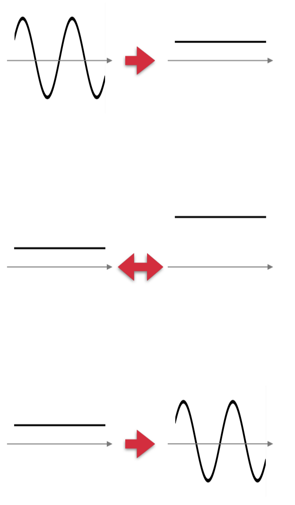]]
]

---

## The main components of power electronics devices

  

.center.width-80[**Controllable switches that can be actuated at a high frequency, without excessive losses, and with a large lifetime**]

  

.grid[
.kol-1-2[
Ideal switch model:
- no losses
- switches without delay
]
.kol-1-2[.width-100[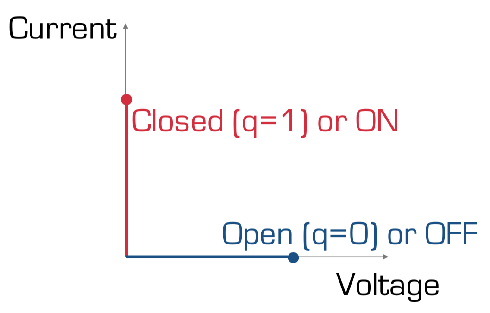]]
]

---

## Realistic switch model
   
.center.width-50[]

---

## Diode models: ideal diode

.center.width-80[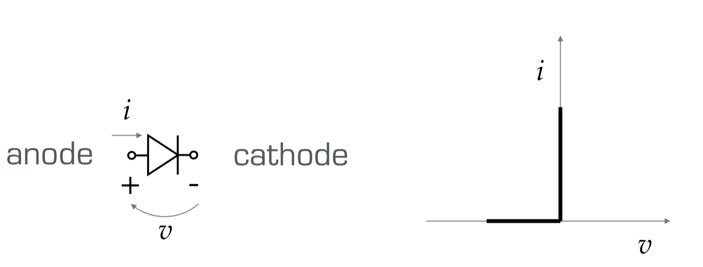]

- Current flows from anode to cathode when forward biased: $i>0 \Rightarrow v=0 $
- No current when reversed bias: $v<0 \Rightarrow i=0$

Not really controllable, hence not suited for all applications.

---

## Diode models: realistic diode in the forward bias region

.center.width-80[]

Piecewise linear approximation of “true exponential model”.

---

## Thyristors

.center.width-20[]

Thyristors are “controllable diodes”, through a gate where a signal is applied

Different types:
- GTO (gate turn off) can be turned on and off, less than 1kHz switching frequency
- SCR (silicon-controlled rectifier): can be turned on, turns off when forward current goes through zero
- TRIAC (Triode alternating current): two SCR back to back with one gate (AC-AC conversion)

---

## Transistors

.grid[
.kol-1-2[
Bipolar junction transistors (BJT)
 
.center.width-40[]
- Historically used as amplifiers in their active region of operation
- Can also be used as a switch, in the saturation region
- High power, but high losses
]
.kol-1-2[
Field effect transistors (MOSFET)
 
.center.width-40[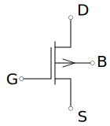]
- High speed and high efficiency at low voltage.
- Isolated gate (field effect)
- Commonly used for low voltage converters
]]
---

## Insulated Gate Bipolar Transistor (IGBT)

- Most common device for high power DC-DC converters and inverters from medium to high voltages
- Combination of BJT and MOSFET
- Now replaces thyristors in most medium to high power applications

.center.width-20[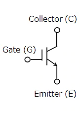]

---

## Characterization of power electronics devices

*DC component*: 
- Integral of the output signal over a full AC input cycle.
- In case of a rectifier, this is the power that is really transmitted from source to load.

--

count: false

*Total Harmonic Distortion*:
THD = ratio of the total signal, including harmonics, to the desired frequency component:

$$THD = \sqrt{\frac{F^2\_{RMS}-F^2\_{RMS,1}}{F^2\_{RMS}}}$$

IEEE standard 519–1992, “Recommended Practices and Requirements for Harmonic Control in Electrical Power Systems”, states that the voltage THD is limited to 5% for general systems and is only up to 20% for dedicated systems

---

# Rectifiers
.center.width-30[]

Rectifiers: large subclass of topologies for AC to DC conversion
- Single-phase or three phase voltage source to DC current load
- Power-electronic is “only” the front end: 
 
 
.center.width-100[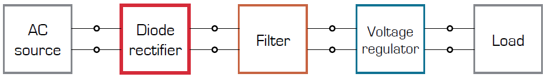]

---

## Half bridge single phase topology

.center.width-90[]

DC component: $V\_{DC} = \frac{V_p}{2 \pi} \int_0^\pi \sin(t) dt = -\frac{V_p}{2 \pi} \cos(t)|\_0^\pi = \frac{V_p}{\pi}$

---

## Full-bridge single phase topology

.center.width-90[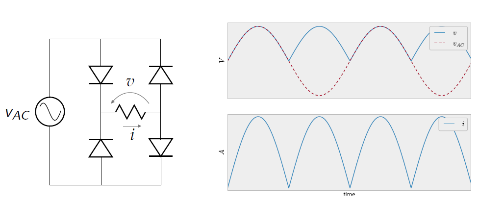]

- DC component twice of the half bridge
- But large harmonic current in the input AC current
- DC output not controllable

---

## Full-bridge single phase topology *with low pass filter*

.center.width-90[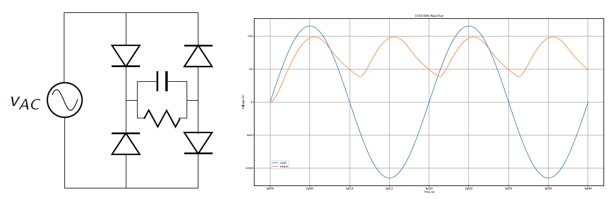]

- Improves output harmonics content
- Better if capacitor size increases
 - which in turn degrades harmonic content of input
- Bad power factor => LC topology
- Active power factor correction => DC-DC after the rectifier

---

## Recap with more realistic components

.center.width-100[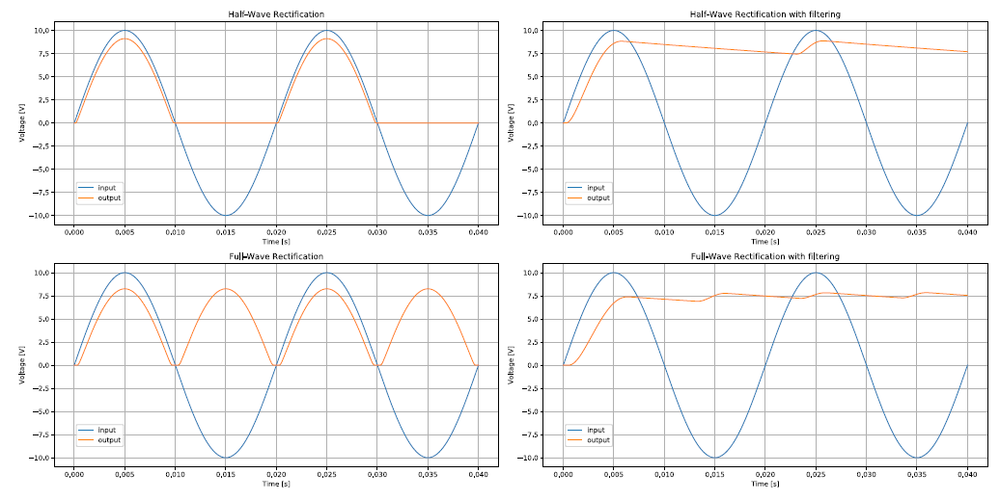]

---

class: middle, center

## 6-pulse rectifier (3-phase source)

<iframe width="600" height="450" src="https://www.youtube.com/embed/WVI8Z7p_rdY" frameborder="0" allowfullscreen></iframe>

---

# DC - DC converters

.center.width-30[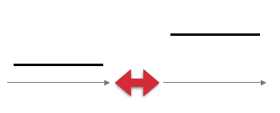]

- DC-DC converters are present in many devices,
 - from mW power level to MW level
- Made possible by MOSFET and IGBTs
- Can be unidirectional, from low voltage to high voltage or the inverse, or bidirectional
 - $v\_h > v\_l$, $i\_l>i\_h$

---

## Basic bloc: two switches

.center.width-100[]

Only one switch ON at a time! 

---

## Pulse Width Modulation (PWM)

- Process that actuates the switches
- Duty cycle signal compared to a reference triangular waveform of a chosen frequency

.center.width-80[]

---

class: middle, center

## PWM exemple video

<iframe width="600" height="450" src="https://www.youtube.com/embed/5nwNKPs2gco" frameborder="0" allowfullscreen></iframe>

---

## Converter types

.grid[
.kol-1-2[*BUCK*

$q\_1$ is a controllable switch and $q\_2$ is a diode
.center.width-60[]
.center.width-80[]
$v\_h = 48 V$ (DC), duty cycle = 50%
]
.kol-1-2[*BOOST*

$q\_2$ is a controllable switch and $q\_1$ is a diode
.center.width-60[]
.center.width-70[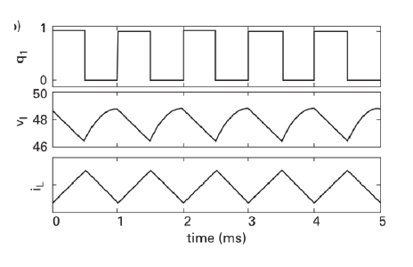]
$v\_l = 24 V$ (DC), duty cycle = 50%

]
]

Transient analysis concepts from [ELEC0053](https://github.com/bcornelusse/livre_circuits_electriques_ELEC0053) can be used to study these systems.

---

# Inverters

.center.width-30[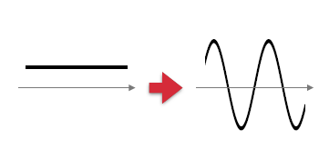]

- Voltage source inverter: $v\_{AC} < v\_{DC}$
- Current source inverter: $v\_{AC} > v\_{DC}$
- Impedance source inverter : for a wide variation of $v\_{AC} \leq v\_{DC}$

.center.width-50[]

---

class: middle, center

## How an inverter works

<iframe width="600" height="450" src="https://www.youtube.com/embed/qVeERT4nyz8" frameborder="0" allowfullscreen></iframe>

---

class: middle, center

## 6-pulse inverter (3-phase)

<iframe width="600" height="450" src="https://www.youtube.com/embed/jOquS6uqpeY" frameborder="0" allowfullscreen></iframe>

---

class: middle, center
# Power generation sources

---

# Wind turbines

- Wind turbines convert the mechanical power of wind into electrical power.
- The power of the wind can be derived from its kinetic energy
  $$ E_w = \frac{1}{2} m v^2$$ 
  As power is the time derivative of energy, we have, assumming the speed is constant:
  $$P_w = \frac{dE_w}{dt} = \frac{1}{2} \frac{dm}{dt} v^2$$
   And
  $\frac{dm}{dt} = \rho A v$ with $A$ the area crossed by the wind,
  and $\rho$ is the mass of air by unit of volume. This yields
  $$ P_w = \frac{1}{2} \rho A v^3 $$

---

## Power conversion

 Only a fraction of the wind power is harvested by the blades.
Actually, the energy harvested is function of the speed of the air
  that enters the blades, $v_u$, and speed of the air that leaves the
  blades, $v_d$: $$P_b = \frac{1}{2} \frac{dm}{dt}(v_u^2 - v_d^2)$$

Approximating $\frac{dm}{dt}$ by $\rho A \frac{v_u-v_d}{2}$ and
defining the coeffitient $\lambda_w$ as
$$ \lambda_w = \frac{v_d}{v_u} $$

Then the power harvested by the turbine can be written as
$$P_b = \frac{1}{2} \rho A \frac{v_u - \lambda_w v_u}{2} (v_u^2 - \lambda_w^2 v_u^2)$$

---

## Turbine efficiency

If we define the coefficient
$$ C_p = \frac{1}{2} (1+\lambda_w) (1-\lambda_w^2)$$ Then
$$P_b = \frac{1}{2} C_p \rho A v_u^3$$

*Betz limit*:

- It can be shown that there is a theoretical limit for $C_p$ at
  $$\frac{16}{27} = 59.2\%$$
- This limit is reached for $\lambda_w = 1/3$.

---

## Efficiency of different technologies as a function of tip-speed ratio (TSR)

.center.width-80[]

TSR = rotor tip speed / wind speed.

---

class: middle, center

## Electromechanical conversion

<iframe width="600" height="450" src="https://www.youtube.com/embed/JJr4PIuQp2w" frameborder="0" allowfullscreen></iframe>

---

## Electromechanical conversion
So far, we have only been talking about mechanical power conversion!

Several types of generators can be used to convert mechanical power into electrical power:
- Synchronous machine
- DC machine
- Induction machine
- Doubly fed induction machine

Brushless variants of (some of) these machines can be used to decrease maintenance needs, through permanent magnets. Those cannot be used for large size generators (> several hundreds of kW).

---

## Power electronics interface

Most of the time, and especially in microgrids operation, these generators are coupled with power electronics to generate power with an appropriate shape:
- the output of the generator goes through a DC convertion
stage (rectifier if AC generator, DC-DC if DC generator) to
cope with wind speed variations
- if the distribution grid is AC, then there is an additional
inverter stage.

Power electronics are also used
- to maximize the energy harvested, especially for low-to-medium
power generators (instead of adapting rotor speed through
e.g. controlling blade pitch):
- to limit the power output at high wind speeds to avoid
degradation

---

## Wind generator operating characteristic

.center.width-80[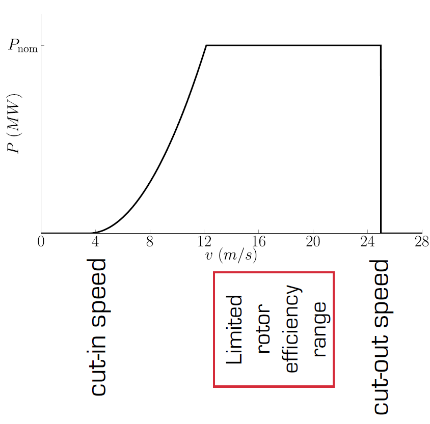]

---

# Photovoltaic generation

A PV cell is composed of semiconductor material. Photons emitted by the sun interact with the semiconducting material in two ways:
1. photons directly transmit energy to electrons and allow them to move into the conduction band.
2. a thermally generated current as in a p-n junction (diode).

---

class: middle, center

<iframe width="600" height="450" src="https://www.youtube.com/embed/L_q6LRgKpTw" frameborder="0" allowfullscreen></iframe>

---

## Effect of temperature and irradiance

.center.width-100[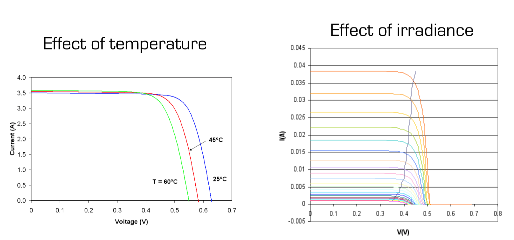]

.grid[
.kol-1-2[Source: https://en.wikipedia.org/wiki/Theory_of_solar_cells]
.kol-1-2[Source: https://en.wikipedia.org/wiki/Maximum_power_point_tracking]
]

---

class: middle, center

.center.width-100[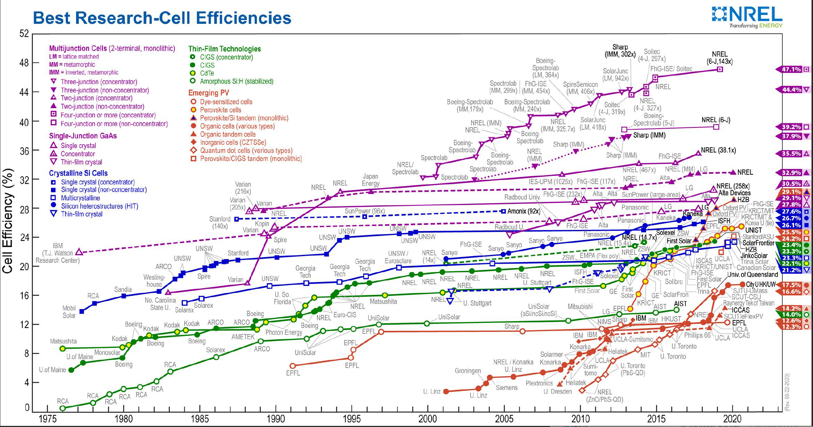]

.footnote[Source: https://www.nrel.gov/pv/cell-efficiency.html]

---

## Equivalent electrical model

.center.width-60[]

- "It can be shown that for a high-quality solar cell (low $R\_S$ and $I\_0$ (diode parameter), and high $R\_{SH}$) the short-circuit current $I\_{SC} \approx I\_L$"
- The open-circuit voltage is approximately equal to the voltage accross the diode
- Both are function of irradiance and temperature

.footnote[Source: https://en.wikipedia.org/wiki/Theory_of_solar_cells]

---

## Maximum power point

.center.width-70[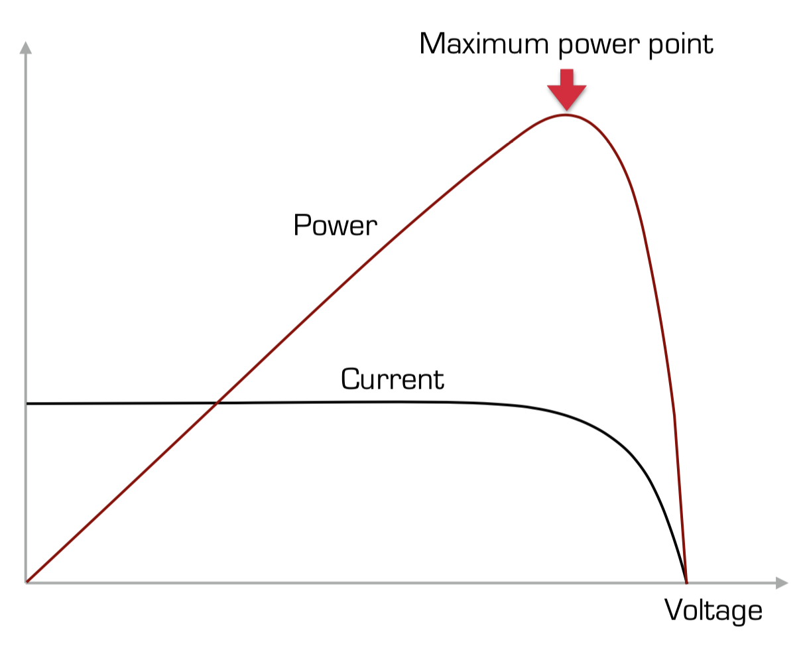]

---

## PV panels

PV cells are arranged into panels. PV cells are combined in series and in parallel.
PV panels are then arranged in parallel and/or in series:

- Parallel: same open circuit voltage, increased short circuit current
- Series: same short circuit current, increased open circuit voltage, but current limited by PV panel delivering the smallest current.

Hence a shadowed or damaged panel can impact the whole array. In practice, PV panels arangement is a mix of series and parallel connections. This trade-off is also impacted by the number and types of power electronics equipment that a particular configuration requires.

---

## Integrating PV arrays

Extreme approaches:

.grid[
.kol-1-2[
A single central power electronics interface for entire array:
- low cost in power electronics,
- high cost in installation and cabling, low reliability.
- Highly impacted by damages, shadow cannot reach MPP per panel
]
.kol-1-2[
One interface for each PV panel (module-integrated):
- High cost in power electronics,
- low cost in installation and cabling, high reliability.
- Robust to damages, shadow
- can optimize MPP per panel
]
]

Realistic approaches:
1. One converter per string
2. Multiple-input converters

---

## Power electronics interface

1. A DC-DC converter connected at the output of the panel (or string of panels) aiming at reaching the MPP.
2. An inverter to connect to the grid (or another DC-DC converter if it is a DC bus).

---

## Maximum power point tracking (MPPT)
Assume a PV panel feeds a resistor $R\_0$.

$R\_0$ is almost never equal to $R\_{MPP} = \frac{V\_{MPP}}{I\_{MPP}}$ since:

1. $R\_0$ can vary in time depending on the user needs, 
2. $R\_{MPP}$ is function of irradiance and temperature.

Hence the panel is usually not naturally operating at its MPP:
.center.width-90[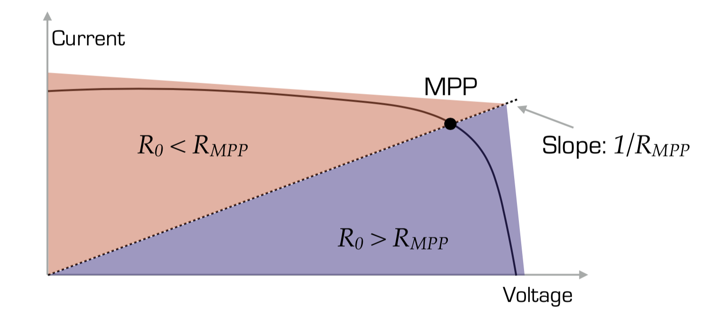]

---

## Maximum power point tracking (2)
To achieve MPP, the DC-DC converter between the PV panel and the resistor is configured to maintain a situation such that the PV panel "sees" a resistance of $R\_{MPP}$.

For instance, for a buck converter, it should be $\frac{R\_0}{D^2}$ where $D$ is the duty cycle of the converter. 
Note that this works only if $R\_{MPP} > R\_0$ since $D \leq 1$.

Several algorithms exist to adapt the value of the duty cycle dynamically. 

Basic idea: at MPP, 
- $\frac{dP\_{PV}}{dV\_{PV}} = 0$, 
- use an iterative algorithm to identify the value of $V\_{PV}$ that achieves this.

Note that this algorithm works well for a single PV panel, but if a converter is connected to a complex combination of PV panels, several local optima may exist and thus require more advanced solutions.

---

# Fuel cells

A combination (fuel cell + electrolyzer) can be seen as a storage device.

We focus here on the electricity (and heat) generation part, i.e. the fuel cell.

A fuel cell converts chemical energy directly into electricity. Unlike a battery, it requires a continuous flow of $H\_2$ fuel:
- each $H\_2$ molecule reacts at the anode and gives two electrons 
- the remaining $2 H+$ ions pass through the membrane and react with oxygen + electrons coming from the cathode to produce water

---

## Proton exchange membrane fuel cells (PEMFC)
These are the most common implementation of fuel cells:
- the anode and cathode catalyst is platinum 
- the membrane is made fof Nafion

The reversible voltage is

$$E\_r = 1.23 V$$

From thermodynamics, it can be shown that the maximum efficiency is
$$\eta\_{\max} = 0.83$$

In practice, its efficiency varies between *35%* and *60%*. The main factor affecting its performance is the fuel flow.

---

## Fuel cell operation
- Fuels cells have a MPP of operation that corresponds to a cell output voltage of approximately 0.4V
- The power electronics interface must be designed to account for this low cell voltage, hence to provide a high input-output voltage step-up ratio
- Another important factor is that the cell must be operated with a relatively constant current output. Else, it can lead to a loss of performance or even to degradation of the membrane and catalysts

---

# Microturbines

- Moderate cost and efficiency (20% to 30%)
- Failure rate is relatively low
- Moderately fast dynamic response
- Usually fueled with natural gas (NG), but can work with other fuels
- Units of 20 to 500 kW

---

## Working principle of a microturbine

1. Entering air is compressed
2. It is then mixed with the fuel in a combustion chamber
3. The mix is ignited, hence the temperature increases and the volume of the air increases
4. The expanded air actuates the turbine
5. The turbine drives the shaft of the generator
6. The heat of the exhausted air is reused to warm the compressed air.

Microturbines usually follow a *Brayton* thermodynamic cycle.

Efficiency is affected 
- by the temperature ratio between the entering air and the compressed air (hence the reuse of exhaust gases to warm up the air in the compression chamber) 
- the compression ratio

---

## Power electronics interface

The shaft rotates at a high speed, in the range 50,000 to 120,000 rpm. Hence the output voltage of the generator is in the kHz range.

A microtrubines thus requires a **rectifier** (+ inverter if connected to an AC grid).

---

# Internal combustion engines (ICEs) a.k.a. Gensets

ICEs are widespread:
- low capital cost,
- low operation and maintenance costs*
- can be easily moved from one place to another
- Can be designed to work with a variety of fuels
- Units of several kW to several MW.

*Fuel may nevertheless be very expensive in some parts of the world.

---

## Working principle of ICEs

1. Intake (induction) stroke
2. Compression stroke
3. Power stroke: combustion/expansion 
4. Exhaust stroke

ICEs follow an *Otto* thermodynamic cycle.

[Example product](https://www.mtu-solutions.com/content/dam/mtu/products/power-generation/may-2021/3238071_PG_spec_4R0080DS55_55kVA_3B_50Hz_Iveco.pdf/_jcr_content/renditions/original./3238071_PG_spec_4R0080DS55_55kVA_3B_50Hz_Iveco.pdf)

---

class: middle, center
# Implementing solar MPPT algorithms
## Assignment

---

class: middle, center

<iframe width="600" height="450" src="https://www.youtube.com/embed/0ItjKs7aJFM" frameborder="0" allowfullscreen></iframe>

---

## Assignment

See the pdf on the course website for the details.

---

# References

- Kwasinski, Alexis, Wayne Weaver, and Robert S. Balog. Microgrids and other local area power and energy systems. Cambridge University Press, 2016.

---

class: end-slide, center
count: false

The end.
