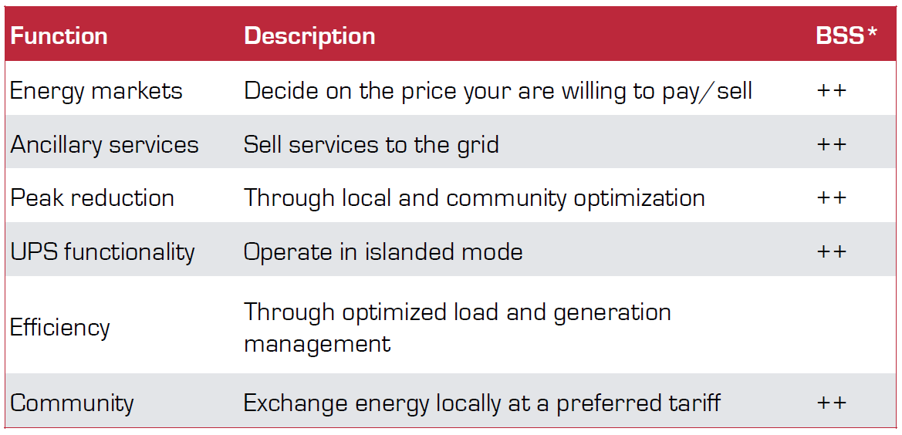
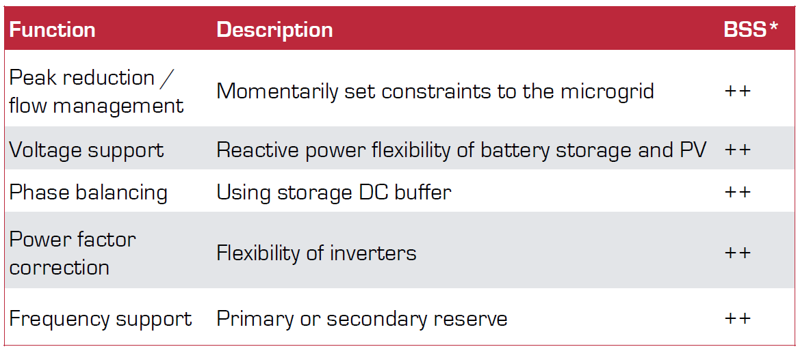
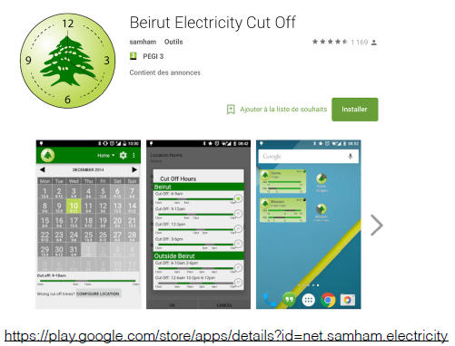
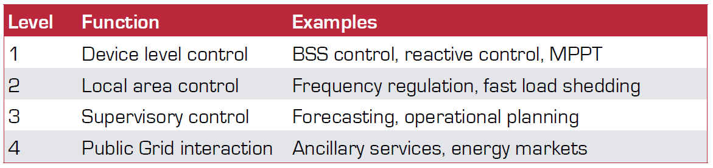

class: middle, center, title-slide
count: false

# Microgrids

Introduction & course organization

  

Bertrand Cornélusse 
[bertrand.cornelusse@uliege.be](mailto:bertrand.cornelusse@uliege.be)

---

# What we will do in this lecture

- Introduction 
 - motivation, comparison to bulk power systems
 - fifty shades of microgrids
- Organization and plan of the course
 - grading
 - assignments
 - references

---

class: middle, center

# Introduction

---

## The current power system in “developed” countries

.grid[.kol-1-2[.center[:)]
- It has been working seamlessly for users for decades
- at a relatively affordable price
- with a high service level]
.kol-1-2[.center[(:]
- Relies heavily on hydrocarbons from extraction, that will inevitably vanish
- Nuclear power losing public support, and expensive 
- Centralized, long distances, not always good for reliability and efficiency
- Public adoption issues for expansion
- hard to reproduce everywhere
- Difficulties to organize smarter distribution grids because of the huge investments needed, the difficulty of coordination between the actors, the difficulty to leverage the demand-side flexibility, and the difficulty to make regulation evolve]
]

---

class: middle, center

Can microgrids solve some of the cons while keeping the pros?

---

## A bit of history: Edison vs. Tesla
.grid[
.kol-1-2[
- First grids followed Edison’s view, were DC and localized
- Tesla and co. imposed the bulk/centralized view in AC
 - More adapted to motors
 - Easier to raise/decrease voltage level, thus reduce losses
- Now Edison view can be implemented because technically
feasible:
 - power electronics, energy storage, advanced load control,
intelligent control, and communication
 - (not necessarily through DC grids, although this could be an
option).]
.kol-1-2[.center[.width-80[] 
[Interview of the author](https://www.c-span.org/video/?178806-1/empires-light-edison-tesla-westinghouse)]]
]

---

## First definition of a microgrid

A microgrid (MG) is a “complete” but small power system.

It is a network of consumer, generation and storage devices that can be optimized jointly to satisfy goals(*).
 - it can connect (be tied) to or disconnect (be islanded) from the main grid

It makes more sense when those devices are within clearly defined electrical boundaries.

It is on the “customer side”, although it can be operated by a third party.

*We will see later on what are the goals, or functions of a microgrid

---

## Components of a microgrid
- People
- Consumption devices
- Generation devices
- Storage devices
- Inverters
- A network
- Sensors and actuators

---

## Schematic example

.center.width-100[]
Source image taken from [Typhoon HIL webstite](https://www.typhoon-hil.com/)

---

class: middle, center, black-slide
<iframe src="https://player.vimeo.com/video/458079980" width="640" height="360" frameborder="0" allow="autoplay; fullscreen" allowfullscreen></iframe>

The MiRIS project

---

## "Copper plate" assumption

In this course, unless stated otherwise, we (almost) neglect the network connecting the components of the microgrid.

This means mainly that we neglect losses, and other electrical phenomena that can be caused by the impedance of the cables connecting the devices.

Why?

 - because network modeling is the topic of other courses (ELEC0447, ELEC0448)
 - because we will focus on other aspects not covered in these courses: MPPT, forecasting, operational planning, sizing.

---

## Schematically

.center.width-100[]

POI: Point of interconnection, also called point of common coupling (PCC)

---

## Main goals of a microgrid 

.center.width-100[]

---

## Why building/studying microgrids?
The 
- development of distributed generation, 
- decreasing costs of storage means, 
- evolution of communication and sensing technologies 

open new options to the conventional distribution of electric energy and new possibilities for integrating distributed generation smoothly in constantly evolving energy and ancillary services markets.

Energy markets and ancillary services markets defined on the next slides.

---

## Energy markets
.grid[
.kol-1-2[
- Energy markets organize the sales and purchases of the electricity commodity
- They are organized by time frame (futures, day-ahead, intra-day)
- By actively participating in the market, you can obtain the electricity at the price you are willing to pay or sell only if profitable.]
.kol-1-2[.center.width-100[]
]]

- Examples of market operators: Epex-Spot, NPS, …
- Microgrids are most of the time too small to access to the market. They’ll have to go through a “third party”, i.e. a retailer + balance responsible party (BRP)

---

## System operators

Market operators, retailers and producers should not be confused with System operators (SOs):
- E.g. ELIA is the Belgian Transmission System Operator (TSO)
- E.g. Resa and ORES are Distribution System Operators (DSOs) in the Walloon region

---

##  Ancillary services markets

- Ancillary services (AS) are offered by entities that have the ability to modulate their generation or consumption, within prespecified boundaries and time frame, to help the system:
 - for balancing generation and demand
 - for relieving congestions
 - for voltage support
- AS markets are organized by the TSO (e.g. ELIA in Belgium) for balancing services, and also by the DSO for local services (this is
currently a topic of active discussion)

---

## Differences with a classical power system

- Sharing economy
- Local / circular economy
- Increased resilience / robustness
- Capitalise on local data
- Simpler decision chain / interaction model

---

## A (grid-tied) microgrid offers many value creation mechanisms
.center.width-100[]

*BSS: Battery Storage System

---

## Advantages for the public grid
.center.width-100[]
*BSS: Battery Storage System

---

## A microgrid is smaller, so necessarily there are less economies of scale than in the current power system

Yes and no!

- Yes if it is assumed that
 - Generating electricity remotely and in large quantities is economically  and environmentally efficient
 - Building a large transmission and distribution system is feasible, both economically and financially
- No if it assumed that:
 - Producing energy locally is actually affordable and easily implementable
 - Heat and electricity are both needed
 - Building a transmission and distribution is infeasible
 - Storage (both short-term and long-term) is affordable and efficient.

---

class: middle, center

# Some special cases

---

## Off-grid microgrids
.grid[
.kol-1-2[
- Off-grid microgrids are a special case of microgrid
- They have no connection to a public grid either because
 - the public grid does not exist
 - the public grid exists but is unreliable
- Some people may also want to isolate from the grid for other technical, philosophical or regulatory reasons.]
.kol-1-2[.center.width-100[]]]

---
class: middle, center, black-slide

<iframe width="640" height="360" src="https://www.youtube.com/embed/jSMHas5JFzA" frameborder="0"  allowfullscreen></iframe>

---

## Local energy communities

.grid[
.kol-1-2[
*Single-user microgrid*: loads, generation, storage, a network, a connection to the grid (the definition of a micro-grid we have seen so far)
Note: legal, e.g. your house with PV and storage.

*Community microgrid*: a group of single-user microgrids + a microgrid operator. 
Note: legal or not depending on the region you live in and the particular situation.
]
.kol-1-2[.center.width-100[]]
]

Forming a local community allows reaching a critical size, but opens up other issues (regulatory, organizational, of fairness, etc.)

---

## The MeryGrid project

.center.width-100[]

Cornélusse, B., Ernst, D., Warichet, L., & Legros, W. (2017). Efficient management
of a connected microgrid in Belgium. In Proceedings of the 24th International
Conference on Electricity Distribution, Glasgow, 12-15 June 2017. Available [here](https://orbi.uliege.be/handle/2268/211726).

---

class: middle, center, black-slide
<iframe src="https://player.vimeo.com/video/458079700" width="640" height="360" frameborder="0" allow="autoplay; fullscreen" allowfullscreen></iframe>

The MeryGrid project

---

class: middle, center

# Microgrid controllers

---

## Microgrid controllers - definition

A microgrid controller is a software that is sensing the microgrid (currents, voltages, frequency, etc.) and taking control actions so as to operate safely, reliably and optimally the microgrid.

In practice, a microgrid is run by multiple controllers, because there are several levels of control, which differ by their spatial and temporal scopes.

Next to technological advances in production, consumption and storage, controllers are key elements for advanced microgrids.

---

## Control levels

.center.width-100[]

We will focus mainly on levels 3 and 4, and a bit about level 2.

---

## Some functions of microgrid controllers

- Frequency control
 - balance generation and load => maintain frequency
 - fast real-time, milli seconds
 - Some predefined primary sources respond to frequency deviation (droop control)
- Voltage control
 - Regulation of voltage a PCC within a respecified range (magnitude and phase)
 - fast real-time, milli seconds
 - Some predefined primary sources respond to voltage deviation (droop control)
- Grid connected to islanded transition : intentional or unintentional
 - Islanded means MG keeps operating but is disconnected from main grid
 - intentional means controller can prepare (e.g. start a genset, reduce current through PCC, etc.)
 - unintentional means in reaction to a large disturbance, either internal or external to the MG

---

## Some functions of microgrid controllers (2)
- Islanded to grid-connected transition
 - MG resynchronizes and reconnects to the distribution system
- Energy management: grid connected
 - Cf. all advantages offered by MG on previous slide
- Energy management: islanded
 - “Economy mode” to power critical loads as long as possible
- Microgrid protection
 - Configuration of protections of devices depending on operating conditions (e.g. islanded or not, a genes is up and running or not, etc.)
- Microgrid black start
 - Restore islanded operation after complete shutdown

---

class: middle, center

# Course organization

---

## Content of the course
- Review microgrid components, technology and trends
- The main focus will be on design and optimal control of a microgrid
 - Formulation of the associated control, optimization and machine learning problems
 - With an introduction to the required mathematical background
 - Detailed models of some components
- Mandatory assignments to practice all these concepts

---

## Important topics that are *not* covered in the course

- Detailed technical models and controllers of components (e.g. inverters):
 - For energy storage, see CHIM0664-1 “Electrochemical energy conversion and storage” by Nathalie Job.
 - For power electronics related topics, see ELEC0055-1 “Element of power Electronics”, by Fabrice Frebel
- Organization of energy markets: ELEC0018-1 “Energy Markets” by Damien Ernst 
- Protection devices and protection schemes

---

## Evaluation: Assignments with small reports and oral presentations.

 - 5 assignments (see course webpage)

---

## Optional references

- Kwasinski, Alexis, Wayne Weaver, and Robert S. Balog. Microgrids and other local area power and energy systems. Cambridge University Press, 2016.
 - Mainly for the parts related to components description.
- Microgrid controllers. IEEE Power & energy magazine, July/August 2017.
 - Main features of controllers, standards, use cases.
---

class: end-slide, center
count: false

The end.
